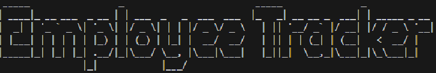

# Employee Tracker System

## Table of Contents
- [Description](#description)
- [Video Walkthrough](#video-walkthrough)
- [Installation](#installation)
- [Usage](#usage)
- [License](#license)
- [Dependencies](#dependencies)
___

## Description

The Employee Tracker System is a command-line application built using Node.js, Inquirer, and PostgreSQL. This system allows users to manage employee data, including departments, roles, and employees, within a company. With the system, you can:

- View departments, roles, and employees.
- Add new departments, roles, and employees.
- Update employee roles.

This app helps streamline the management of a company's employee database.

___

## Video Walkthrough

Here is a walkthrough video demonstrating how to use the Employee Tracker:
https://app.screencastify.com/v3/watch/jgYrIBVGBJlBEfc7FB33

___

## Installation

1. Clone the repository to your local machine.
    ```bash
    git clone https://github.com/ShannonJTaylor/10-EmployeeTracker.git
    ```
2. Navigate into the project folder.
    ```bash
    cd 10-EmployeeTracker
    ```
3. Install dependencies.
    ```bash
    npm install
    ```
4. Set up environment variables. Create a `.env` file in the root directory and include the following:
    ```bash
    DB_USER=your_database_user
    DB_HOST=localhost
    DB_NAME=your_database_name
    DB_PASSWORD=your_database_password
    DB_PORT=5432
    ```
    - Note: if using MySQL, update the connection setting to match your MySQL database credentials.

    ___

## Usage

To run the application, use the following command:

```bash
node index.js
```

When you start the app, you'll see a stylized title generated by Figlet:


You will be prompted to interact with the app through the command line. The available actions include:

View Departments - Display all departments in the company.

View Roles - Display all roles within the company.

View Employees - Display all employees and their details.

Add Department - Add a new department to the system.

Add Role - Add a new role to the company.

Add Employee - Add a new employee, assigning them a role and manager.

Update Employee Role - Change the role of an existing employee.

Exit - Exit the application.

___

## License
This project is licensed under the MIT License - see the [LICENSE](LICENSE) file for details.

___

## Dependencies
Inquirer - For providing a simple and powerful way to handle user input.

Node.js - For being the runtime environment that powers this application.

PostgreSQL - For being the database used to store employee data.

Figlet - For generating the stylized title at startup.
___
**Made with ❤️ by [[ShannonJTaylor](https://github.com/ShannonJTaylor)]**